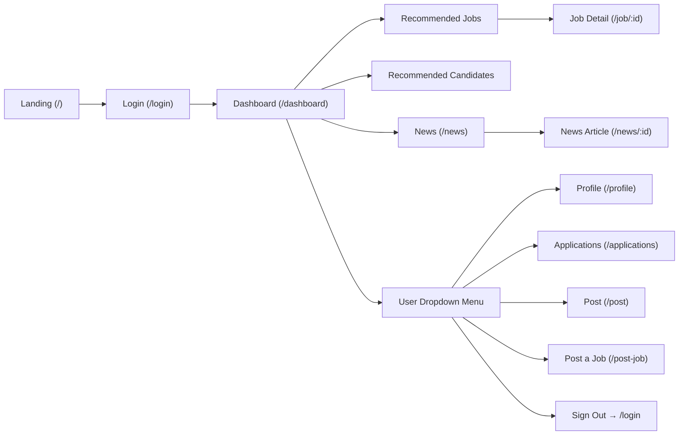

# Project Overview

Workmate is a professional networking and AI-assisted job-matching web application built for a CSIT314 university project. It serves two user roles — **candidates** (job seekers) and **employers** — providing a LinkedIn-style interface for browsing jobs, posting listings, reviewing applicants, and following career news. The project is currently **frontend-only**: all data is sourced from inline mock arrays and `src/data/user.json`; `localStorage` stands in for a real auth backend until API integration is complete.

---

# Tech Stack

| Layer | Technology |
|---|---|
| UI framework | React 19, react-dom |
| Routing | React Router DOM v7 (`BrowserRouter` + `Routes`) |
| Build tool | Vite 8 with `@vitejs/plugin-react` |
| Compiler | `@rolldown/plugin-babel` + React Compiler preset (Babel) |
| Styling | Tailwind CSS v4 via `@tailwindcss/vite`; page-level `.css` files for custom overrides |
| Linting | ESLint 9, `eslint-plugin-react-hooks`, `eslint-plugin-react-refresh` |
| Types | `@types/react` / `@types/react-dom` (dev-only; no TypeScript compilation) |
| State | Local `useState` only — no Redux, no Context API |

---

# Frontend Structure

## Pages

All pages are **lazy-loaded** via `React.lazy` + `<Suspense>` in [`src/App.jsx`](src/App.jsx).

| File | Route | Description |
|---|---|---|
| `landing.jsx` | `/` | Cinematic hero page with a fullscreen background video, sticky navbar, and scroll-reveal sections (About, Reach Us). First entry point for unauthenticated visitors. |
| `login.jsx` | `/login` | Two-column layout: left branding panel with animated floating bubbles; right panel with sign-in / sign-up tab switcher. Sign-in validates email + password against `MOCK_USERS` from `user.json` — role is inferred from the matched record via `normalizeRole()` (no role selector on sign-in). Sign-up tab shows a Candidate / Employer role toggle; the name field label adapts to the selected role. Sign-in form includes a show/hide password toggle and a "Remember me" checkbox (UI only). On success writes `workmate_signed_in`, email, and role to `localStorage` via `userService.js` and redirects to `/dashboard`. |
| `dashboard.jsx` | `/dashboard` | Main app home after sign-in. Displays a job card grid, a social post feed, a news ticker, and a contact sidebar — all powered by inline mock data. |
| `recommended_job.jsx` | `/recommended-jobs` | Candidate-facing page with three job sections (AI-chosen, based on viewed jobs, related roles). Includes a collapsible `JobFilter` panel and show-more toggle per section. |
| `recommended_candidate.jsx` | `/recommended-candidates` | Employer-facing mirror of the above; shows candidate cards in three sections (AI-chosen, search history, saved). Uses `CandidateFilter` and the same expand/collapse pattern. |
| `job_description.jsx` | `/job/:id` | Full job detail view with requirements, company description, benefits, and an Apply button. Currently renders a single mock object regardless of the `:id` param. |
| `news.jsx` | `/news` | Browsable news feed split into "Latest News" and a secondary section. Each card links to `/news/:id`. |
| `news_information.jsx` | `/news/:id` | Full article view for a news item with a featured image, author, and body text. Like `job_description`, still uses a single mock object for all IDs. |
| `post.jsx` | `/post` | Social feed page with a create-post textarea and a list of sample posts rendered by the `Post` component. |
| `post_job.jsx` | `/post-job` | Employer form for creating a new job listing: title, company info, description, education level, required skills, years of experience, work mode, and location. Includes client-side validation. |
| `profile.jsx` | `/profile` | Candidate/employer profile editor. Manages personal info, education, work experience (dynamic entries), a 400-word "About You" bio, resume upload, and profile picture preview. Pre-populates from `userService` on mount. |
| `applications.jsx` | `/applications` | Role-aware page: candidates see saved jobs + applied jobs (JobCards); employers see their posted jobs + saved candidates (CandidateCards). Role is read from `localStorage` via `userService`. |
| `mynetwork.jsx` | `/mynetwork` | Professional connections page — layout and header are in place; content section shows a "coming soon" placeholder. |
| `settings.jsx` | `/settings` | Settings page shell that reuses `placeholder.css` styling and displays a "coming soon" message with a back-to-home link. |
| `help.jsx` | `/help` | Help Center with a static FAQ accordion and a contact/support section linking to the `Contact` component. |
| `placeholder.jsx` | `/hr-news`, `/portal`, `/privacy`, `/terms`, `/lawyers-corners` | Shared "coming soon" shell used for all unbuilt routes. Reads the current path to display a matching title. |

## Components

Components live under `src/components/` in feature folders (`ComponentName/ComponentName.jsx`).

**Layout**

- **`Navbar/Navbar.jsx`** — Top navigation bar with three zones: brand logo, expandable search bar (with role-appropriate filter popover), and a user dropdown or "Join Now" button. Auth state is read from `localStorage`; sign-out clears storage and redirects to `/login`. Nav links and dropdown items differ between candidate and employer roles.
- **`Footer/Footer.jsx`** — Dark footer with a site-map, legal links, and a "Back to top" scroll button. Used on all authenticated pages.

**Cards**

- **`JobCard/JobCard.jsx`** — Clickable card linking to `/job/:id`; displays company initial avatar, job title, company name, employment type, and location. Used on `dashboard`, `recommended_job`, and `applications`.
- **`CandidateCard/CandidateCard.jsx`** — Card displaying a candidate's name, location, applied role, experience, and education. Used on `recommended_candidate` and `applications` (employer view).
- **`NewsCard/NewsCard.jsx`** — Left-bordered card linking to `/news/:id`; shows news headline, source company, and post time. Used on `dashboard` and `news`.

**Feed**

- **`Posts/Post.jsx`** — Single social post card with author avatar, timestamp, text content, optional image, like count, and comment count. Used by `post.jsx` and `dashboard.jsx`.
- **`PostCard/PostCard.jsx`** — Alternative social post component that exists in the component tree but is **not currently imported** by any page; reserved for future use.

**Filters**

- **`FilterSection/JobFilter.jsx`** — Multi-field filter panel for job search (location, salary, category, employment type, experience, etc.). Embedded in the Navbar search popover and on `recommended_job`.
- **`FilterSection/CandidateFilter.jsx`** — Equivalent filter panel for candidate search (name, experience level, degree, major, availability, etc.). Used in Navbar popover and on `recommended_candidate`.

**Job Detail**

- **`JobDesription/JobTitle.jsx`** — Renders the job title, company, location, salary, and employment type header block on `job_description`. (Note: folder name is `JobDesription` — one 's' — matching the repo as-is.)
- **`JobDesription/JobDetails.jsx`** — Renders the tabbed or sectioned body of a job listing (requirements, what we need, about the company, benefits).

**News Article**

- **`NewsDescription/NewsTitle.jsx`** — Header block for a news article: headline, company, posted-by, and date. Used on `news_information`.
- **`NewsDescription/NewsDetails.jsx`** — Body section of a news article with featured image and full content text.

**Misc / Helpers**

- **`Contact/Contact.jsx`** — Sticky left-sidebar contact card shown on `dashboard`, `recommended_job`, `recommended_candidate`, and `post`.
- **`ProfilePictureCard/ProfilePictureCard.jsx`** — Avatar display / upload trigger widget used inside `profile.jsx`.
- **`Button/Showmore.jsx`** — Toggle button for expanding/collapsing card grids (show more / show less). Used across recommendation pages.
- **`Button/ApplyJob.jsx`** — Call-to-action apply button rendered on `job_description`.
- **`Button/Profile_Button.jsx`** — Despite the filename, this file exports `FeatureCardGrid`, a responsive 3-column grid of feature cards. The filename/export mismatch is a known inconsistency.

## State & Data Flow

- **Auth session:** Login sets three `localStorage` keys — `workmate_signed_in` (`'true'`), `workmate_current_user_email`, and `workmate_user_role` — via `setCurrentUserEmail()` and `setCurrentUserRole()` helpers in `userService.js`. Role is inferred from the matched user record (not from a form selector on sign-in). Navbar reads these keys on mount to decide which links and dropdown items to show; sign-out removes all three.
- **User data:** `src/services/userService.js` exports helpers (`getCurrentUser`, `findUserByEmail`, `getCurrentUserRole`, etc.) that read from `localStorage` and look up records in `src/data/user.json`. Two demo accounts exist: `user@user.com` (candidate) and `employer@employer.com` (employer), both with password `1`.
- **Page-level state:** Every page manages its own UI state with `useState` — form fields, filter values, show-more toggles, file previews, validation errors. There is no shared global state store.
- **Mock data:** Job listings, candidates, posts, and news items are defined as `const` arrays inline inside each page file. Comments throughout mark the exact places to replace with API calls (`// BACKEND DEV NOTE`, `// TODO (backend integration)`).
- **Routing:** `BrowserRouter` in `main.jsx` wraps the entire app; `App.jsx` defines all routes with `React.lazy` + `<Suspense>`. Unknown paths fall through to `<Navigate to="/" replace />`.

---

# Backend Structure

Not implemented in this repo — to be updated when an API is added.

---

# Key Conventions

- **Lazy routing:** Every page is loaded with `React.lazy(() => import(...))` in `App.jsx`; a single `<Suspense fallback>` wraps all routes for code splitting.
- **Component folders:** Each component lives in its own folder matching its name (`Button/ApplyJob.jsx`, `JobCard/JobCard.jsx`). Config files are isolated under `config/` (Vite, Tailwind, ESLint).
- **Explicit `.jsx` extensions:** Import paths always include `.jsx` (e.g. `import Navbar from '../components/Navbar/Navbar.jsx'`).
- **Inline mock data:** Mock arrays are named in `SCREAMING_SNAKE_CASE` (e.g. `MOCK_JOBS`, `AI_CHOSEN_JOBS`) and placed at the top of each page file, ready to be swapped for API calls.
- **Backend handoff markers:** All future API integration points are flagged with `// BACKEND DEV NOTE` or `// TODO (backend integration)` comments; running `grep "BACKEND DEV"` surfaces every handoff point.
- **Tailwind + scoped CSS:** Most styling uses Tailwind utility classes directly in JSX. A small number of pages have a companion `.css` file for complex animations or layout that is hard to express in utilities (e.g. `landing.css`, `placeholder.css`).
- **Role-aware UI:** Components like `Navbar` and `applications.jsx` branch on the `workmate_user_role` value from `localStorage` to show different links, labels, and data depending on whether the user is a candidate or employer.

---

# User Flow

- **Visitor:** Lands on `/`, watches the hero video, reads About / Reach Us, then clicks "Join Now" to reach `/login`.
- **Sign-in:** Selects role (Candidate or Employer), enters demo credentials; on success, `localStorage` is populated and the user is navigated to `/dashboard`.
- **Candidate flow:** Navbar shows Home, Help, Recommended Jobs, News. They browse job cards, open a job detail, and access profile / applications / posts from the user dropdown.
- **Employer flow:** Navbar shows Home, Post a Job, Help, Recommended Candidates. They browse candidate cards, post new listings, and review applicants from the user dropdown.
- **Sign-out:** Clears all `workmate_*` keys from `localStorage` and redirects to `/login`.
