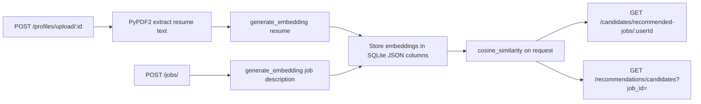
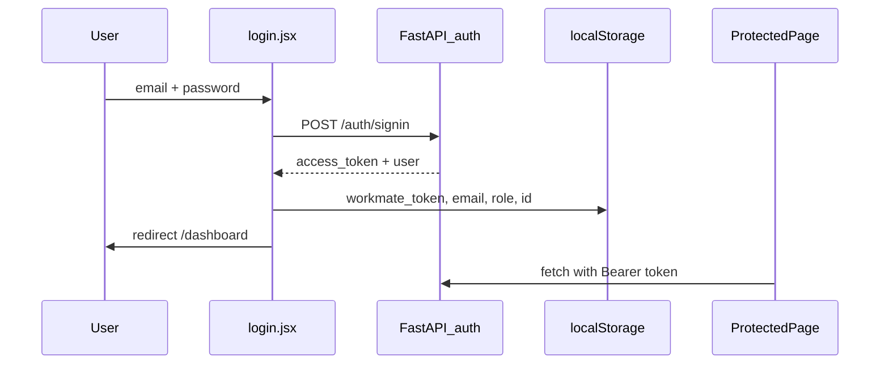
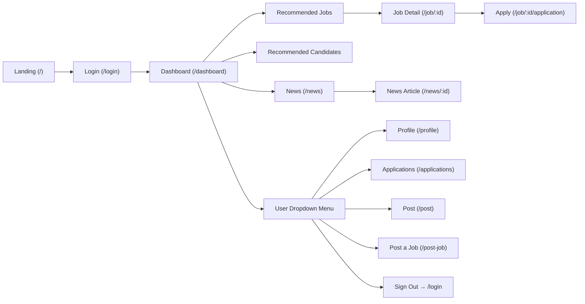

# Project Overview

Workmate is a professional networking and AI-assisted job-matching web application built for a CSIT314 university project. It serves two user roles — **candidates** (job seekers) and **employers** — providing a LinkedIn-style interface for browsing jobs, posting listings, reviewing applicants, and following career news.

**Current state:** The project is **hybrid** — a FastAPI + SQLite backend provides real persistence, JWT auth, and AI recommendations; the React frontend calls the API for most core flows but several UI areas still use inline mock data or placeholders.

## Repository Layout

```
Workmate/
├── frontend/          # React + Vite (npm install && npm run dev)
├── backend/           # FastAPI + SQLite (uvicorn main:app --reload)
├── docker-compose.yml # Frontend Docker only (dev + prod profiles)
├── CLAUDE.md          # This file — full project reference for AI agents
└── README.md          # Quick-start guide for developers
```

---

# Tech Stack

## Frontend

| Layer | Technology |
|---|---|
| UI framework | React 19, react-dom |
| Routing | React Router DOM v7 (`BrowserRouter` + `Routes`) |
| Build tool | Vite 8 with `@vitejs/plugin-react` |
| Compiler | `@rolldown/plugin-babel` + React Compiler preset (Babel) |
| Styling | Tailwind CSS v4 via `@tailwindcss/vite`; page-level `.css` files for custom overrides |
| Linting | ESLint 9, `eslint-plugin-react-hooks`, `eslint-plugin-react-refresh` |
| Types | `@types/react` / `@types/react-dom` (dev-only; no TypeScript compilation) |
| State | Local `useState` only — no Redux, no Context API |
| HTTP | Native `fetch` — no axios |
| API config | `VITE_API_BASE_URL` in `frontend/.env` (default `http://127.0.0.1:8000`) |
| Container | `frontend/Dockerfile` (dev HMR + nginx prod); `docker-compose.yml` profiles |

## Backend

| Layer | Technology |
|---|---|
| Framework | FastAPI |
| Server | Uvicorn |
| ORM / DB | SQLAlchemy + SQLite (`workmate.db`) |
| Auth | python-jose (JWT, HS256) + werkzeug (password hashing) |
| File uploads | python-multipart; PDF parsing via PyPDF2 |
| AI matching | sentence-transformers (`all-MiniLM-L6-v2`), scikit-learn cosine similarity, numpy |
| Fuzzy search | fuzzywuzzy + python-Levenshtein |
| Static files | FastAPI `StaticFiles` at `/uploads` |
| CORS | `CORSMiddleware`, `allow_origins=["*"]` |

---

# Running Locally

## Backend (port 8000)

```bash
cd backend
python -m venv venv
source venv/bin/activate   # Windows: venv\Scripts\activate
pip install -r requirements.txt
uvicorn main:app --reload
```

- API docs: `http://127.0.0.1:8000/docs`
- SQLite DB created on first startup at `backend/workmate.db`
- Seed data (~50 jobs, 5 posts, 5 news) runs automatically if DB is empty
- Uploads stored in `backend/uploads/resumes/` and `backend/uploads/profiles/`

## Frontend (port 5173)

```bash
cd frontend
npm install
npm run dev
```

Ensure `frontend/.env` contains:

```
VITE_API_BASE_URL=http://127.0.0.1:8000
```

## Docker (frontend only)

```bash
# Development (Vite HMR) → http://localhost:5173
docker compose --profile dev up --build

# Production (nginx) → http://localhost:8080
docker compose --profile prod up --build
```

The backend is **not** in `docker-compose.yml` yet — run it locally via uvicorn. The commented backend service still references the old `./be` path.

---

# Backend Architecture

## Layer pattern

```
HTTP Request
    ↓
routes/          # FastAPI routers — parse request, call service
    ↓
services/        # Business logic, validation, auth checks
    ↓
repositories/    # SQLAlchemy queries
    ↓
models/          # SQLAlchemy ORM table definitions
    ↓
SQLite (workmate.db)
```

Entry point: [`backend/main.py`](backend/main.py) — mounts 11 routers, CORS, static `/uploads`, startup `init_db()` + `seed_database()`.

## Route modules

| Prefix | Module | Purpose |
|---|---|---|
| `/auth` | `routes/auth.py` | Sign-up, sign-in |
| `/users` | `routes/users.py` | User CRUD |
| `/profiles` | `routes/profiles.py` | Candidate profiles + resume/picture upload |
| `/employer_profiles` | `routes/employer_profiles.py` | Employer company profiles |
| `/jobs` | `routes/jobs.py` | Job CRUD + search |
| `/applications` | `routes/applications.py` | Apply, list applications, update status |
| `/saved` | `routes/saved.py` | Save/unsave jobs and candidates |
| `/posts` | `routes/posts.py` | Social posts + comments |
| `/news` | `routes/news.py` | News articles CRUD |
| `/candidates` | `routes/candidates.py` | AI job recommendations for candidates |
| `/recommendations` | `routes/recommendations.py` | AI candidate recommendations for employers |

**Note:** There is **no `/api` prefix**. Actual paths are e.g. `/auth/signin`, not `/api/auth/login`.

## API endpoints (summary)

### Auth — no JWT required

| Method | Path | Body | Response |
|---|---|---|---|
| POST | `/auth/signup` | `{ email, password, full_name, role }` | `{ message }` (201) — no token |
| POST | `/auth/signin` | `{ email, password }` | `{ access_token, user: { id, email, full_name, role } }` |

### Jobs

| Method | Path | Auth | Notes |
|---|---|---|---|
| GET | `/jobs/` | No | List all jobs |
| GET | `/jobs/{job_id}` | No | Job detail |
| POST | `/jobs/` | JWT | Create job; `user_id` set from token |
| PUT | `/jobs/{job_id}` | JWT | Update job |
| DELETE | `/jobs/{job_id}` | JWT | Delete job |
| POST | `/jobs/search` | No | Filter body: `location`, `title`, `company`, `job_type`, `salary_min`, `salary_max` |

### Applications — JWT required

| Method | Path | Notes |
|---|---|---|
| GET | `/applications/user/{user_id}` | Candidate's applications |
| GET | `/applications/job/{job_id}` | Applicants for a job (employer) |
| POST | `/applications/` | `{ user_id, job_id, status }` |
| PUT | `/applications/{id}/status` | `{ status }` |
| DELETE | `/applications/{id}` | Remove application |

### Saved — JWT required

| Method | Path | Notes |
|---|---|---|
| GET | `/saved/user/{user_id}` | All saved items |
| POST | `/saved/` | Save job or candidate |
| DELETE | `/saved/{saved_id}` | Unsave |
| GET | `/saved/check/{user_id}/{job_id}` | Check if job saved |
| POST | `/saved/job/{user_id}/{job_id}` | Toggle save |

### Profiles — JWT required

| Method | Path | Notes |
|---|---|---|
| GET | `/profiles/{user_id}` | Candidate profile |
| POST | `/profiles/` | Create profile |
| PUT | `/profiles/{user_id}` | Update profile |
| POST | `/profiles/upload/{user_id}` | Multipart: resume PDF + profile picture; triggers embedding |

### Employer profiles — JWT required

| Method | Path | Notes |
|---|---|---|
| GET | `/employer_profiles/{user_id}` | Employer profile |
| POST | `/employer_profiles/` | Create |
| PUT | `/employer_profiles/{user_id}` | Update |

### Posts — JWT for mutations

| Method | Path | Auth |
|---|---|---|
| GET | `/posts/` | No |
| GET | `/posts/{post_id}` | No |
| POST | `/posts/` | JWT |
| PUT | `/posts/{post_id}` | JWT |
| DELETE | `/posts/{post_id}` | JWT |
| POST | `/posts/{post_id}/comments` | JWT |

### News — JWT required for all routes

| Method | Path |
|---|---|
| GET | `/news/` |
| GET | `/news/{news_id}` |
| POST | `/news/` |
| PUT | `/news/{news_id}` |
| DELETE | `/news/{news_id}` |

### AI recommendations

| Method | Path | Auth | Notes |
|---|---|---|---|
| GET | `/candidates/recommended-jobs/{user_id}?limit=` | No | Resume–job cosine similarity |
| POST | `/candidates/update-resume-embedding/{user_id}` | No | Regenerate resume embedding |
| POST | `/candidates/batch-generate-job-embeddings` | No | Batch job embedding generation |
| GET | `/recommendations/candidates?job_id=&limit=` | No | Top candidates for a job |

### Users

| Method | Path | Auth |
|---|---|---|
| GET | `/users/` | No |
| GET | `/users/{user_id}` | No |
| POST | `/users/` | No |
| PUT | `/users/{user_id}` | JWT |
| DELETE | `/users/{user_id}` | JWT |

### Static

| Path | Notes |
|---|---|
| `/uploads/*` | Resume and profile picture files |
| `/docs` | Swagger UI |

## Database models

| Model file | Table | Key fields |
|---|---|---|
| `models/user.py` | `users` | `id`, `full_name`, `email`, `password`, `role`, timestamps |
| `models/job.py` | `jobs` | `user_id`, `title`, `company`, `job_type`, `location`, `description`, `requirements`, `salary_min/max`, `job_embedding` (JSON) |
| `models/profile.py` | `profiles` | `user_id`, contact/education fields, `resume_url`, `resume_text`, `resume_embedding`, `experiences` (JSON) |
| `models/employer_profile.py` | `employer_profiles` | Company fields tied to `user_id` |
| `models/application.py` | `applications` | `user_id`, `job_id`, `status` (default `"applied"`) |
| `models/saved_item.py` | `saved_items` | `user_id`, optional `job_id` or `candidate_id` |
| `models/post.py` | `posts` | `author_id`, `content`, `image_url`, `likes`, `comments_count` |
| `models/comment.py` | `comments` | `post_id`, `user_id`, `content` |
| `models/news.py` | `news` | `headline`, `company`, `content`, `image_url` |

## Seed data

[`backend/seed_data.py`](backend/seed_data.py) runs on startup if no jobs exist:
- ~50 synthetic jobs with embeddings
- 5 posts
- 5 news articles

**Does not seed demo users.** Users must register via `/auth/signup` or be created manually.

## AI recommendation flow



Model: `all-MiniLM-L6-v2` via sentence-transformers. See [`backend/utils/embeddings.py`](backend/utils/embeddings.py).

## Auth implementation

- Password hashing: werkzeug `generate_password_hash` / `check_password_hash`
- JWT config: [`backend/config.py`](backend/config.py) — `SECRET_KEY`, HS256, 30-minute expiry
- Token payload: `{ sub: email, role, user_id, exp }`
- Protected routes: `HTTPBearer` dependency `get_current_user()` in [`backend/services/auth_service.py`](backend/services/auth_service.py)
- **Gaps:** No logout endpoint, no refresh tokens, minimal role enforcement on routes

---

# Frontend Structure

All pages are **lazy-loaded** via `React.lazy` + `<Suspense>` in [`frontend/src/App.jsx`](frontend/src/App.jsx).

## Pages

| File | Route | Role | Data source | Description |
|---|---|---|---|---|
| `landing.jsx` | `/` | Guest | Static | Cinematic hero with CloudFront video, sticky nav, About / Reach Us scroll sections. "Join Now" → `/login`. |
| `login.jsx` | `/login` | Guest | **API** | Sign-in / sign-up tabs. API: `POST /auth/signin`, `POST /auth/signup`. Stores JWT + user info. Role toggle on sign-up only. |
| `dashboard.jsx` | `/dashboard` | Both | **API** | Job grid, news ticker, posts feed, Contact sidebar. API: `GET /jobs`, `/posts`, `/news`. Uses `normalizeApiJob()`. |
| `recommended_job.jsx` | `/recommended-jobs` | Candidate | **API + mock fallback** | `JobFilter`, AI recommendations via `GET /candidates/recommended-jobs/:userId`, search via `POST /jobs/search`. Fallback mock `AI_CHOSEN_JOBS` if API fails. |
| `recommended_candidate.jsx` | `/recommended-candidates` | Employer | **API** | Job selector, `GET /recommendations/candidates?job_id=`. Client-side filter/sort via `CandidateFilter`. |
| `job_description.jsx` | `/job/:id` | Both | **API** | Dynamic job detail. Save/unsave, apply button (candidates), applicant list (job owner). API: `/jobs/:id`, `/saved/*`, `/applications/job/:id`. |
| `JobDesription/application.jsx` | `/job/:id/application` | Candidate | **API** | Apply flow: CV upload/saved CV, cover letter UI, success modal. API: `GET /jobs/:id`, `POST /applications/` via `applicationStore.js`. Cover letter not sent to API. |
| `post_job.jsx` | `/post-job` | Employer | **API** | Job posting form with validation. API: `POST /jobs/`. Uses `jobStore.js` constants. |
| `post.jsx` | `/post` | Both | **API** | Create-post form + feed. API: `GET/POST /posts/`. Dead code: unused `SAMPLE_POSTS` array. |
| `profile.jsx` | `/profile` | Both | **API** | Candidate/employer profile editor. API: `/profiles/*`, `/employer_profiles/*`, `POST /profiles/upload/:id`. |
| `applications.jsx` | `/applications` | Both | **API + mock** | Candidate: saved + applied jobs (API). Employer: posted jobs (API) + **mock** `savedCandidates` array. |
| `news.jsx` | `/news` | Both | **Mock** | Three sections (Latest / Hot / Big Company) from inline `MOCK_NEWS`. Dashboard uses API news; these pages do not. |
| `news_information.jsx` | `/news/:id` | Both | **Mock** | Single `MOCK_NEWS_DATA` for all IDs — ignores `:id` param. |
| `help.jsx` | `/help` | Both | Static | FAQ accordion + contact section. |
| `settings.jsx` | `/settings` | Both | Placeholder | Coming-soon shell with `placeholder.css`. |
| `mynetwork.jsx` | `/mynetwork` | Both | Placeholder | Header + "coming soon". |
| `placeholder.jsx` | `/hr-news`, `/subscription`, `/portal`, `/privacy`, `/terms`, `/lawyers-corners` | Both | Placeholder | Shared coming-soon shell; title derived from path. |

## Components

Components live under `frontend/src/components/` in feature folders (`ComponentName/ComponentName.jsx`).

**Layout**

- **`Navbar/Navbar.jsx`** — Brand, expandable search + filter popover, notification bell, role-aware nav links/dropdown. Auth via `workmate_token`. Sign-out clears storage → `/login`. Search and notifications are **UI-only mock** (BACKEND DEV NOTE in file).
- **`Footer/Footer.jsx`** — Site map, legal links, back-to-top. Used on authenticated pages.

**Cards**

- **`JobCard/JobCard.jsx`** — Clickable card → `/job/:id`. Optional inline `SaveJob` button. Used on dashboard, recommended_job, applications.
- **`CandidateCard/CandidateCard.jsx`** — Candidate avatar, name, location, resume link (prefixed with `VITE_API_BASE_URL`). Used on recommended_candidate, applications, job_description.
- **`NewsCard/NewsCard.jsx`** — Headline card → `/news/:id`. Used on dashboard, news.

**Feed**

- **`Posts/Post.jsx`** — Social post card (author, content, image, like/comment counts). Used by post.jsx and dashboard.jsx.
- **`PostCard/PostCard.jsx`** — Alternate post card. **Not imported anywhere.**

**Filters**

- **`FilterSection/JobFilter.jsx`** — Job search filter panel (`page` | `popover` variants). Used on recommended_job and Navbar popover.
- **`FilterSection/CandidateFilter.jsx`** — Candidate filter panel. Used on recommended_candidate and Navbar popover.

**Job Detail**

- **`JobDesription/JobTitle.jsx`** — Job header block on job_description and application page. (Folder name has one 's' — repo convention.)
- **`JobDesription/JobDetails.jsx`** — Requirements, what we need, about company, benefits sections.
- **`JobDesription/application.jsx`** — Full apply page (lazy-loaded route, not a typical component).

**News Article**

- **`NewsDescription/NewsTitle.jsx`** — Article header on news_information.
- **`NewsDescription/NewsDetails.jsx`** — Article body + featured image.

**Misc / Helpers**

- **`Contact/Contact.jsx`** — Sticky sidebar with mock `CONTACTS` list. Used on dashboard, recommended_job, recommended_candidate, post.
- **`ProfilePictureCard/ProfilePictureCard.jsx`** — Avatar upload/preview widget in profile.jsx.
- **`Button/Showmore.jsx`** — Show more/less toggle on dashboard.
- **`Button/ApplyJob.jsx`** — "Apply Now" CTA on job_description → navigates to `/job/:id/application`.
- **`Button/SaveJob.jsx`** — Save/unsave toggle. Used in JobCard and job_description.
- **`Button/Profile_Button.jsx`** — Exports `FeatureCardGrid`. **Not imported anywhere** (filename/export mismatch).

## Services

| File | Purpose |
|---|---|
| [`userService.js`](frontend/src/services/userService.js) | localStorage helpers: email, role, id, token clear on logout. `findUserByEmail()` / `getCurrentUser()` still read legacy [`user.json`](frontend/src/data/user.json) — not used for login validation. |
| [`jobStore.js`](frontend/src/services/jobStore.js) | Shared form constants (`EMPLOYMENT_TYPES`, `WORK_ARRANGEMENTS`, etc.). `normalizeApiJob()` adapter maps API job shape → UI shape. Legacy localStorage helpers (`workmate_posted_jobs`) — post flow now uses API directly. |
| [`applicationStore.js`](frontend/src/services/applicationStore.js) | `submitApplication()`, `fetchUserApplications()`, `hasApplied()` via `/applications` API. Resume metadata in `workmate_saved_resume` localStorage. |

## Utils

| File | Purpose |
|---|---|
| [`jobFilters.js`](frontend/src/utils/jobFilters.js) | Pure `matchesJobFilters(job, filters)`. **Dead code** — not imported anywhere. |

## Data files

| File | Purpose |
|---|---|
| [`user.json`](frontend/src/data/user.json) | Two legacy demo records (`user@user.com`, `employer@employer.com`). Still loaded by `getCurrentUser()` but login no longer validates against this file. |

---

# State & Data Flow

## Auth session

Sign-in flow (`login.jsx`):
1. `POST /auth/signin` → receive `{ access_token, user }`
2. Store in localStorage: `workmate_token`, `workmate_current_user_email`, `workmate_user_role`, `workmate_user_id`
3. Redirect to `/dashboard`

Sign-up flow:
1. `POST /auth/signup` → `{ message }` (no token returned)
2. Auto sign-in via `POST /auth/signin`
3. Same storage + redirect

Sign-out (`Navbar` → `clearCurrentUser()`):
- Removes token, email, role, id → redirect `/login`

**Protected API calls** send:

```
Authorization: Bearer <workmate_token>
```

## localStorage keys

| Key | Set by | Purpose |
|---|---|---|
| `workmate_token` | login.jsx | JWT — primary signed-in check (`!!workmate_token` in Navbar) |
| `workmate_current_user_email` | login.jsx / userService | User email |
| `workmate_user_role` | login.jsx / userService | `"candidate"` or `"employer"` |
| `workmate_user_id` | login.jsx / userService | Numeric user ID for API calls |
| `workmate_saved_resume` | applicationStore.js | CV filename + upload timestamp (client-only metadata) |
| `workmate_posted_jobs` | jobStore.js | Legacy local job cache (unused in current post flow) |

**Removed:** `workmate_signed_in` — no longer referenced.

## Page-level state

Every page manages its own UI state with `useState` — form fields, filter values, show-more toggles, file previews, validation errors. No shared global state store.

## API adapter pattern

Backend job objects use snake_case fields (`job_type`, `created_at`, etc.). Pages call `normalizeApiJob()` from `jobStore.js` to map to the canonical UI shape expected by `JobCard` and `JobDetails`.

---

# Frontend ↔ Backend Integration Matrix

| Frontend file | Backend endpoints | Status |
|---|---|---|
| `login.jsx` | `POST /auth/signin`, `/auth/signup` | Wired |
| `dashboard.jsx` | `GET /jobs`, `/posts`, `/news` | Wired |
| `job_description.jsx` | `GET /jobs/:id`, `/saved/*`, `/applications/job/:id` | Wired |
| `JobDesription/application.jsx` | `GET /jobs/:id`, `POST /applications/` | Wired (cover letter not sent) |
| `post_job.jsx` | `POST /jobs/` | Wired |
| `post.jsx` | `GET/POST /posts/` | Wired |
| `profile.jsx` | `/profiles/*`, `/employer_profiles/*`, upload | Wired |
| `applications.jsx` | `/saved`, `/applications`, `/jobs` | Partial — employer saved candidates mock |
| `recommended_job.jsx` | `/candidates/recommended-jobs/:id`, `POST /jobs/search` | Partial — `AI_CHOSEN_JOBS` fallback |
| `recommended_candidate.jsx` | `/jobs`, `/recommendations/candidates` | Wired (filter client-side) |
| `news.jsx`, `news_information.jsx` | — | Mock (backend `/news` exists but pages don't call it) |
| `Navbar.jsx` search | — | Mock UI (should use `POST /jobs/search`) |
| `Navbar.jsx` notifications | — | Mock (`MOCK_NOTIFICATIONS`; no backend) |
| `Contact.jsx` | — | Mock contacts list |
| `landing`, `help`, `settings`, `mynetwork`, `placeholder` | — | Static / placeholder |

---

# Auth Flow



---

# Key Conventions

- **Lazy routing:** Every page loaded with `React.lazy(() => import(...))` in `App.jsx`; single `<Suspense fallback>` wraps all routes.
- **Component folders:** Each component in its own folder matching its name. Config isolated under `frontend/config/`.
- **Explicit `.jsx` extensions:** Import paths always include `.jsx`.
- **Inline mock data:** Mock arrays named in `SCREAMING_SNAKE_CASE` at top of page files. Remaining mocks flagged for future API wiring.
- **Backend handoff markers:** `// BACKEND DEV NOTE` comments in Navbar and elsewhere. Grep: `grep -r "BACKEND DEV" frontend/src`.
- **Tailwind + scoped CSS:** Most styling via Tailwind utilities. Companion `.css` for complex animations (`landing.css`, `placeholder.css`).
- **Role-aware UI:** Navbar, applications, and other pages branch on `workmate_user_role` from localStorage.
- **No axios:** All HTTP via native `fetch` with `VITE_API_BASE_URL`.
- **No `/api` prefix:** Backend routes are root-level (e.g. `/jobs/`, not `/api/jobs/`).

## Dead / legacy code (do not treat as active)

| Item | Location | Notes |
|---|---|---|
| `PostCard` | `components/PostCard/` | Not imported |
| `FeatureCardGrid` | `Button/Profile_Button.jsx` | Not imported |
| `matchesJobFilters` | `utils/jobFilters.js` | Not imported |
| `SAMPLE_POSTS` | `pages/post.jsx` | Dead array; feed uses API |
| `appendPostedJob` import | `pages/post_job.jsx` | Imported but not called |
| `user.json` login validation | `data/user.json` | Legacy; login uses API |
| `workmate_posted_jobs` | `jobStore.js` | Legacy localStorage cache |
| Stale TODO header | `pages/login.jsx` | Says mock auth; already API-based |

---

# User Flow



- **Visitor:** Lands on `/`, watches hero video, reads About / Reach Us, clicks "Join Now" → `/login`.
- **Sign-in / sign-up:** Register or sign in via API; JWT stored in localStorage; redirect to `/dashboard`.
- **Candidate flow:** Navbar shows Home, Help, Recommended Jobs, Subscription. Browse jobs, open detail, apply via `/job/:id/application`, manage profile/applications/posts from dropdown.
- **Employer flow:** Navbar shows Home, Post a Job, Help, Recommended Candidates, Subscription. Post listings, browse AI-recommended candidates, review applicants on job detail and applications page.
- **Sign-out:** Clears all `workmate_*` auth keys and redirects to `/login`.

---

# Known Gaps & Future Work

Priority order for remaining integration:

1. **News pages** — Wire `news.jsx` and `news_information.jsx` to `GET /news/` and `GET /news/:id` (dashboard already uses API).
2. **Navbar search** — Connect filter popover to `POST /jobs/search` (candidate) or future candidate search endpoint.
3. **Notifications** — Backend has no `/notifications` routes; Navbar uses `MOCK_NOTIFICATIONS`.
4. **Employer saved candidates** — Replace mock `savedCandidates` in `applications.jsx` with `/saved` API (candidate saves).
5. **Apply flow** — Send cover letter to backend; align resume upload with profile upload endpoint.
6. **Docker backend service** — Add backend to `docker-compose.yml` (fix `./be` → `./backend`).
7. **Demo user seeding** — Optionally seed `user@user.com` / `employer@employer.com` in `seed_data.py`.
8. **Backend hardening** — Pydantic request schemas, role enforcement, logout endpoint, refresh tokens, production `SECRET_KEY`.
9. **Tests** — No test suite exists for frontend or backend.
10. **Stale docs/comments** — Remove outdated TODO headers in `login.jsx`; update Navbar BACKEND DEV NOTE paths (remove `/api` prefix references).
