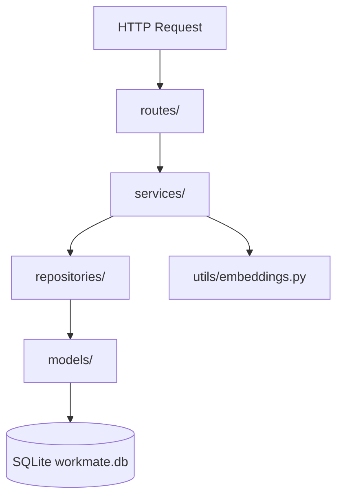

# Backend Developer Guide

> **Branching Rule:** Create a new branch for all backend work. Do NOT commit directly to `main`.

---

## Overview

The Workmate backend is a **FastAPI + SQLite** API server with JWT authentication, file uploads, and AI-powered job/candidate matching via sentence-transformers.

The frontend is **hybrid** — most core flows (auth, jobs, applications, profiles, posts, recommendations) call this API. Some UI areas (news pages, navbar search/notifications) still use mock data. See the integration map below and [`../CLAUDE.md`](../CLAUDE.md) for full project context.

**Base URL:** `http://127.0.0.1:8000` (configured in `frontend/.env` as `VITE_API_BASE_URL`)

**Important:** Routes have **no `/api` prefix**. Use `/auth/signin`, not `/api/auth/login`.

---

## Architecture

```
backend/
├── main.py              # FastAPI app, CORS, router mounting, startup seed
├── config.py            # JWT secret, algorithm, token expiry
├── database.py          # SQLAlchemy engine + init_db()
├── seed_data.py         # Seeds ~50 jobs, 5 posts, 5 news on first run
├── models/              # 9 SQLAlchemy ORM models
├── routes/              # 11 FastAPI route modules
├── services/            # Business logic layer
├── repositories/        # Database query layer
└── utils/
    └── embeddings.py    # sentence-transformers + cosine similarity
```



---

## Setup

```bash
cd backend
python -m venv venv
source venv/bin/activate   # Windows: venv\Scripts\activate
pip install -r requirements.txt
uvicorn main:app --reload
```

- **API docs:** `http://127.0.0.1:8000/docs`
- **Database:** `backend/workmate.db` (auto-created, gitignored)
- **Uploads:** `backend/uploads/resumes/`, `backend/uploads/profiles/` (gitignored)
- **Seed:** Runs on startup if no jobs exist (~50 jobs with embeddings, 5 posts, 5 news)

### Dependencies

```
fastapi, uvicorn, sqlalchemy, python-jose, passlib, werkzeug,
python-multipart, sentence-transformers, scikit-learn, numpy,
PyPDF2, fuzzywuzzy, python-Levenshtein
```

---

## Auth

### Endpoints

| Method | Path | Auth | Body | Response |
|--------|------|------|------|----------|
| POST | `/auth/signup` | No | `{ email, password, full_name, role }` | `{ message }` (201) |
| POST | `/auth/signin` | No | `{ email, password }` | `{ access_token, user: { id, email, full_name, role } }` |

- `role` must be `"candidate"` or `"employer"`
- Sign-up returns **no token** — frontend auto-signs-in after registration
- Passwords hashed with werkzeug; JWT signed with HS256 (30-min expiry)

### JWT payload

```json
{ "sub": "user@example.com", "role": "candidate", "user_id": 1, "exp": 1234567890 }
```

### Protected routes

Send header on all authenticated requests:

```
Authorization: Bearer <access_token>
```

Dependency: `get_current_user()` in `services/auth_service.py` (HTTPBearer).

### Not implemented

- `POST /auth/logout`
- Refresh tokens
- `GET /users/me` (frontend uses `/profiles/{user_id}` + localStorage user id)

---

## API Endpoint Reference

### Users

| Method | Path | Auth |
|--------|------|------|
| GET | `/users/` | No |
| GET | `/users/{user_id}` | No |
| POST | `/users/` | No |
| PUT | `/users/{user_id}` | JWT |
| DELETE | `/users/{user_id}` | JWT |

### Profiles (candidate)

| Method | Path | Auth | Notes |
|--------|------|------|-------|
| GET | `/profiles/{user_id}` | JWT | Get candidate profile |
| POST | `/profiles/` | JWT | Create profile |
| PUT | `/profiles/{user_id}` | JWT | Update profile |
| POST | `/profiles/upload/{user_id}` | JWT | Multipart: `resume` (PDF), `profile_picture`. Extracts text, generates embedding |

### Employer profiles

| Method | Path | Auth |
|--------|------|------|
| GET | `/employer_profiles/{user_id}` | JWT |
| POST | `/employer_profiles/` | JWT |
| PUT | `/employer_profiles/{user_id}` | JWT |

### Jobs

| Method | Path | Auth | Notes |
|--------|------|------|-------|
| GET | `/jobs/` | No | List all |
| GET | `/jobs/{job_id}` | No | Detail |
| POST | `/jobs/` | JWT | Create; `user_id` from token. Auto-generates job embedding |
| PUT | `/jobs/{job_id}` | JWT | Update |
| DELETE | `/jobs/{job_id}` | JWT | Delete |
| POST | `/jobs/search` | No | Body: `{ location, title, company, job_type, salary_min, salary_max }`. Fuzzy title match |

### Applications

| Method | Path | Auth | Notes |
|--------|------|------|-------|
| GET | `/applications/user/{user_id}` | JWT | Candidate's applications |
| GET | `/applications/job/{job_id}` | JWT | Applicants for a job |
| POST | `/applications/` | JWT | Body: `{ user_id, job_id, status: "applied" }` |
| PUT | `/applications/{application_id}/status` | JWT | Body: `{ status }` |
| DELETE | `/applications/{application_id}` | JWT | Remove application |

### Saved items

| Method | Path | Auth | Notes |
|--------|------|------|-------|
| GET | `/saved/user/{user_id}` | JWT | All saved jobs/candidates |
| POST | `/saved/` | JWT | Save job or candidate |
| DELETE | `/saved/{saved_id}` | JWT | Unsave |
| GET | `/saved/check/{user_id}/{job_id}` | JWT | Check if saved |
| POST | `/saved/job/{user_id}/{job_id}` | JWT | Toggle save |

### Posts

| Method | Path | Auth |
|--------|------|------|
| GET | `/posts/` | No |
| GET | `/posts/{post_id}` | No |
| POST | `/posts/` | JWT |
| PUT | `/posts/{post_id}` | JWT |
| DELETE | `/posts/{post_id}` | JWT |
| POST | `/posts/{post_id}/comments` | JWT |

**Not implemented:** `POST /posts/{post_id}/like` (likes column exists, no endpoint)

### News

| Method | Path | Auth |
|--------|------|------|
| GET | `/news/` | JWT |
| GET | `/news/{news_id}` | JWT |
| POST | `/news/` | JWT |
| PUT | `/news/{news_id}` | JWT |
| DELETE | `/news/{news_id}` | JWT |

### AI recommendations

| Method | Path | Auth | Notes |
|--------|------|------|-------|
| GET | `/candidates/recommended-jobs/{user_id}?limit=` | No | Cosine similarity: resume embedding vs job embeddings |
| POST | `/candidates/update-resume-embedding/{user_id}` | No | Regenerate resume embedding |
| POST | `/candidates/batch-generate-job-embeddings` | No | Batch job embedding generation |
| GET | `/recommendations/candidates?job_id=&limit=` | No | Top candidates for a job |

### Static files

| Path | Notes |
|------|-------|
| `/uploads/resumes/*` | Uploaded PDF resumes |
| `/uploads/profiles/*` | Profile pictures |

---

## Data Models

| Table | Model file | Key fields |
|-------|-----------|------------|
| `users` | `models/user.py` | `id`, `full_name`, `email`, `password`, `role` |
| `jobs` | `models/job.py` | `user_id`, `title`, `company`, `job_type`, `location`, `description`, `requirements`, `salary_min/max`, `job_embedding` |
| `profiles` | `models/profile.py` | `user_id`, education/contact fields, `resume_url`, `resume_text`, `resume_embedding`, `experiences` |
| `employer_profiles` | `models/employer_profile.py` | Company info tied to `user_id` |
| `applications` | `models/application.py` | `user_id`, `job_id`, `status` |
| `saved_items` | `models/saved_item.py` | `user_id`, `job_id` or `candidate_id` |
| `posts` | `models/post.py` | `author_id`, `content`, `image_url`, `likes`, `comments_count` |
| `comments` | `models/comment.py` | `post_id`, `user_id`, `content` |
| `news` | `models/news.py` | `headline`, `company`, `content`, `image_url` |

Request bodies are raw `dict` — no Pydantic schemas yet.

---

## Frontend Integration Map

| Frontend file | Endpoints used | Status |
|---------------|----------------|--------|
| `frontend/src/pages/login.jsx` | `POST /auth/signin`, `/auth/signup` | Wired |
| `frontend/src/pages/dashboard.jsx` | `GET /jobs`, `/posts`, `/news` | Wired |
| `frontend/src/pages/job_description.jsx` | `GET /jobs/:id`, `/saved/*`, `/applications/job/:id` | Wired |
| `frontend/src/components/JobDesription/application.jsx` | `GET /jobs/:id`, `POST /applications/` | Wired |
| `frontend/src/pages/post_job.jsx` | `POST /jobs/` | Wired |
| `frontend/src/pages/post.jsx` | `GET/POST /posts/` | Wired |
| `frontend/src/pages/profile.jsx` | `/profiles/*`, `/employer_profiles/*`, upload | Wired |
| `frontend/src/pages/applications.jsx` | `/saved`, `/applications`, `/jobs` | Partial — employer saved candidates still mock |
| `frontend/src/pages/recommended_job.jsx` | `/candidates/recommended-jobs/:id`, `POST /jobs/search` | Partial — mock fallback |
| `frontend/src/pages/recommended_candidate.jsx` | `/jobs`, `/recommendations/candidates` | Wired |
| `frontend/src/services/applicationStore.js` | `POST /applications/`, `GET /applications/user/:id` | Wired |
| `frontend/src/pages/news.jsx` | — | Mock (backend ready) |
| `frontend/src/pages/news_information.jsx` | — | Mock (backend ready) |
| `frontend/src/components/Navbar/Navbar.jsx` | — | Search + notifications mock |

### localStorage keys (frontend)

| Key | Purpose |
|-----|---------|
| `workmate_token` | JWT |
| `workmate_current_user_email` | Email |
| `workmate_user_role` | Role |
| `workmate_user_id` | User ID for API path params |
| `workmate_saved_resume` | Client-only resume metadata |
| `workmate_posted_jobs` | Legacy — unused |

Legacy `frontend/src/data/user.json` is **not** used for login validation.

---

## Gaps vs Original Spec

These were documented in earlier integration guides but are **not implemented**:

| Planned | Status |
|---------|--------|
| `/api/auth/login`, `/api/auth/register`, `/api/auth/logout` | Use `/auth/signin`, `/auth/signup` instead; no logout |
| `GET /api/users/me` | Use `/profiles/{user_id}` + localStorage id |
| `GET /api/jobs/recommendations` | Use `/candidates/recommended-jobs/{user_id}` |
| `GET /api/jobs/saved`, `/api/jobs/applied` | Use `/saved/*` and `/applications/*` |
| `POST /api/jobs/:id/apply` | Use `POST /applications/` |
| `GET /api/candidates` (list/filter) | Not implemented; employer filters client-side |
| `POST /api/posts/:id/like` | Not implemented |
| All `/api/notifications/*` | Not implemented |
| `GET /api/search` | Only `POST /jobs/search` exists |

---

## Remaining Integration Checklist

**High priority**
- [ ] Wire `frontend/src/pages/news.jsx` → `GET /news/`
- [ ] Wire `frontend/src/pages/news_information.jsx` → `GET /news/{news_id}`
- [ ] Wire Navbar search → `POST /jobs/search`
- [ ] Replace mock `savedCandidates` in `applications.jsx` → `/saved` API

**Medium priority**
- [ ] Implement notifications endpoints + wire Navbar
- [ ] Add cover letter field to applications API + apply page
- [ ] Implement `POST /posts/{post_id}/like`
- [ ] Add candidate list/search endpoint for employer Navbar search

**Infrastructure**
- [ ] Add backend service to `docker-compose.yml` (fix path `./be` → `./backend`)
- [ ] Add Pydantic request/response schemas
- [ ] Add role enforcement on protected routes
- [ ] Add logout endpoint
- [ ] Seed demo users (optional)
- [ ] Replace dev `SECRET_KEY` for production
- [ ] Add test suite

---

## Common Issues

**CORS** — Already configured in `main.py` with `allow_origins=["*"]`. Frontend dev server at `http://localhost:5173` works out of the box.

**401 Unauthorized** — Check that `Authorization: Bearer <token>` header is sent. Token expires after 30 minutes.

**Role-based UI broken** — Sign-in response must include `role: "candidate" | "employer"` in the `user` object (already implemented).

**Empty recommendations** — Candidate must upload a resume via `POST /profiles/upload/{user_id}` so a resume embedding is generated. Jobs need embeddings (auto-generated on create; seeded jobs include them).

**First startup slow** — sentence-transformers downloads `all-MiniLM-L6-v2` model on first embedding request.

**Find integration points in frontend** — `grep -r "BACKEND DEV" frontend/src`
